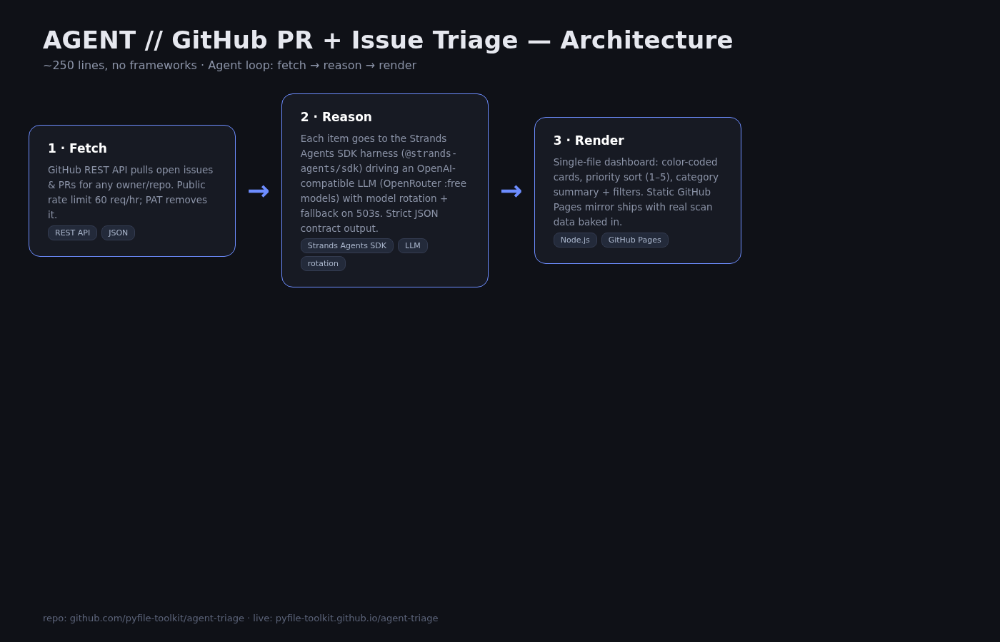

# AGENT // GitHub PR + Issue Triage

An autonomous triage agent for open-source repos. Give it `owner/repository`,
it reads the open issues & PRs, classifies each one with an LLM
(bug / feature / question / duplicate / docs), assigns a priority (1–5),
and renders an at-a-glance dashboard with suggested next actions.

Built as a submission demo for online agent hackathons (All Things Agentic /
Agents for Humans), and as a practical tool for maintainers.

## How it works

1. **Fetch** — GitHub REST API lists open issues + PRs (public).
2. **Reason** — each item is sent to an LLM (OpenRouter free tier, model
   rotation with fallback) with a strict JSON output contract:
   `{"category", "short", "priority"}`.
3. **Render** — a static-first page (no build step) shows cards sorted by
   priority, color-coded by category, each linking to the original issue.

Everything runs on demand — no background jobs, no servers except a thin
local proxy for the LLM call & GitHub rate limits.

## Run

```bash
export LLM_KEY="<openrouter key>"
node server.mjs                # serves :7811
open http://localhost:7811
```

## Files

- `server.mjs` — minimal Node HTTP server + agent loop + LLM rotation
- `index.html` — single-file UI (no dependencies, inline CSS/JS)

## Stack

Node.js (bare `node:http`), GitHub REST API, OpenRouter `:free` models,
no frameworks, no build step — total ~250 lines.

## Demo results

- `typeorm/typeorm` — 22 items scanned, classified (bug/feature/docs…)
- `facebook/react` — 22 items scanned, 22/22 classified, priorities p1–p5
  (e.g. p1 bug: "Freezing props prevents later assignments…", p1 bug:
  "Unbounded debug info causes RangeError on large…")
---
## License
MIT — see [LICENSE](LICENSE).

## Architecture

